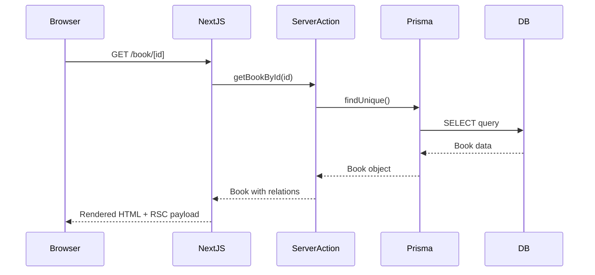

# Arc42 Mimari Dokümantasyonu - AsyaKitap

## 1. Giriş ve Hedefler

### 1.1 Gereksinim Özeti

AsyaKitap, kitap okuyucuları için tasarlanmış kişisel bir kitap takip ve okuma deneyimi yönetim uygulamasıdır.

**Temel Gereksinimler:**
- Kitap ekleme, düzenleme ve silme
- Okuma durumu takibi (okunacak, okunuyor, tamamlandı, bırakıldı)
- Alıntı ve not kaydetme
- Kitap puanlama (10 kategoride detaylı değerlendirme)
- AI destekli içerik analizi (tortu, imza, tartışma soruları)
- Tematik okuma listeleri
- Yıllık okuma hedefleri (challenge)
- Okuma istatistikleri ve görselleştirme

### 1.2 Kalite Hedefleri

| Öncelik | Kalite Hedefi | Açıklama |
|---------|---------------|----------|
| 1 | Kullanılabilirlik | Sezgisel ve hızlı kullanıcı deneyimi |
| 2 | Performans | Hızlı sayfa yüklemeleri (<2s) |
| 3 | Güvenilirlik | Veri kaybı olmaması |
| 4 | PWA Desteği | Mobil cihazlarda native deneyim |

### 1.3 Paydaşlar

| Paydaş | İlgi Alanı |
|--------|------------|
| Son Kullanıcı | Kitap takibi, okuma deneyimi |
| Geliştirici | Kod kalitesi, bakım kolaylığı |

## 2. Kısıtlamalar

### 2.1 Teknik Kısıtlamalar

- **Frontend Framework:** Next.js 16 (App Router)
- **Runtime:** Node.js 18+
- **Database:** PostgreSQL (Supabase hosted)
- **Hosting:** Vercel
- **AI Provider:** Google Gemini AI

### 2.2 Organizasyonel Kısıtlamalar

- Tek geliştirici projesi
- Türkçe kullanıcı arayüzü
- Kişisel kullanım odaklı

## 3. Bağlam ve Kapsam

### 3.1 İş Bağlamı

```
┌─────────────────────────────────────────────────────────────┐
│                      AsyaKitap                               │
│                                                              │
│  ┌──────────┐  ┌──────────┐  ┌──────────┐  ┌──────────┐    │
│  │ Kitap    │  │ Okuma    │  │ AI       │  │ İstatist.│    │
│  │ Yönetimi │  │ Listeleri│  │ Analiz   │  │ & Raporl.│    │
│  └──────────┘  └──────────┘  └──────────┘  └──────────┘    │
│                                                              │
└─────────────────────────────────────────────────────────────┘
        │              │              │              │
        ▼              ▼              ▼              ▼
   ┌─────────┐   ┌─────────┐   ┌─────────┐   ┌─────────┐
   │Supabase │   │PostgreSQL│   │ Gemini  │   │KitapYurdu│
   │  Auth   │   │    DB   │   │   AI    │   │  Search │
   └─────────┘   └─────────┘   └─────────┘   └─────────┘
```

### 3.2 Teknik Bağlam

| Sistem | İletişim | Protokol |
|--------|----------|----------|
| Supabase Auth | Kimlik doğrulama | HTTPS/REST |
| PostgreSQL | Veri saklama | TCP/Prisma |
| Gemini AI | AI analizi | HTTPS/REST |
| KitapYurdu | Kitap arama | Web Scraping |
| Google Books | Kitap arama | REST API |

## 4. Çözüm Stratejisi

### 4.1 Teknoloji Kararları

| Karar | Gerekçe |
|-------|---------|
| Next.js App Router | Server Components, streaming, modern React |
| Server Actions | RPC-tarzı API, type-safety |
| Prisma ORM | Type-safe database queries |
| Radix UI | Erişilebilir, özelleştirilebilir UI primitives |
| Tailwind CSS | Utility-first, hızlı geliştirme |

### 4.2 Mimari Kararlar

- **Monolitik yapı:** Tek Next.js uygulaması
- **Server-first:** Server Actions ile veri işlemleri
- **Progressive enhancement:** PWA ile offline destek
- **AI entegrasyonu:** Opsiyonel AI özellikleri

## 5. Yapı Taşları

### 5.1 Klasör Yapısı

```
asyakitap/
├── app/                    # Next.js App Router
│   ├── (dashboard)/       # Authenticated routes
│   │   ├── dashboard/     # Ana sayfa
│   │   ├── library/       # Kütüphane
│   │   ├── book/[id]/     # Kitap detay
│   │   ├── stats/         # İstatistikler
│   │   ├── challenges/    # Okuma hedefleri
│   │   └── reading-lists/ # Okuma listeleri
│   ├── api/               # API routes
│   └── auth/              # Auth sayfaları
├── actions/               # Server Actions
├── components/            # React bileşenleri
│   ├── ui/               # Temel UI bileşenleri
│   ├── book/             # Kitap bileşenleri
│   ├── challenge/        # Challenge bileşenleri
│   └── stats/            # İstatistik bileşenleri
├── lib/                   # Yardımcı fonksiyonlar
│   ├── prisma.ts         # Prisma client
│   ├── gemini.ts         # AI client
│   └── supabase/         # Supabase client
└── prisma/               # Veritabanı şeması
```

### 5.2 Temel Modüller

#### Library Module
Kitap CRUD işlemleri, durum yönetimi, arama.

```typescript
// actions/library.ts
- addBook()
- updateBook()
- deleteBook()
- getBooks()
- searchBooks()
```

#### AI Module
Gemini AI ile içerik analizi.

```typescript
// actions/ai.ts
- analyzeTortu()
- analyzeImza()
- generateDiscussionQuestions()
- generateExperienceReport()
- extractThemes()
```

#### Stats Module
Okuma istatistikleri ve hesaplamalar.

```typescript
// actions/stats.ts
- getOverviewStats()
- getReadingStats()
- getMonthlyStats()
- getThemeStats()
```

## 6. Çalışma Zamanı Görünümü

### 6.1 Kitap Detay Sayfası



## 7. Dağıtım Görünümü

```
┌─────────────────────────────────────────────────────────┐
│                     Vercel Edge                          │
│  ┌─────────────────────────────────────────────────┐   │
│  │              Next.js Application                  │   │
│  │  ┌───────────┐ ┌───────────┐ ┌───────────┐      │   │
│  │  │  Static   │ │  Server   │ │   API     │      │   │
│  │  │  Assets   │ │Components │ │  Routes   │      │   │
│  │  └───────────┘ └───────────┘ └───────────┘      │   │
│  └─────────────────────────────────────────────────┘   │
└─────────────────────────────────────────────────────────┘
                           │
                           ▼
┌─────────────────────────────────────────────────────────┐
│                    Supabase                              │
│  ┌─────────────┐  ┌─────────────┐                       │
│  │ PostgreSQL  │  │    Auth     │                       │
│  │  Database   │  │   Service   │                       │
│  └─────────────┘  └─────────────┘                       │
└─────────────────────────────────────────────────────────┘
```

## 8. Çapraz Kesitler

### 8.1 Kimlik Doğrulama

- Supabase Auth kullanılır
- Server-side session yönetimi
- Middleware ile rota koruması

### 8.2 Hata Yönetimi

- Server Actions'da try-catch
- Error boundaries ile UI koruması
- Toast bildirimleri (sonner)

### 8.3 Önbellekleme

- Next.js data cache
- Revalidation ile cache invalidation
- In-memory cache (lib/cache.ts)

### 8.4 AI Entegrasyonu

- Rate limiting
- Fallback mekanizmaları
- AI yorumlarının ayrı tabloda saklanması

## 9. Mimari Kararlar

Detaylı ADR'lar için: [ADR Klasörü](../adr/)

## 10. Kalite Gereksinimleri

### 10.1 Kalite Ağacı

```
Kalite
├── Kullanılabilirlik
│   ├── Sezgisel navigasyon
│   ├── Hızlı arama
│   └── Responsive tasarım
├── Performans
│   ├── <2s sayfa yüklemesi
│   ├── Optimistic updates
│   └── Lazy loading
├── Güvenilirlik
│   ├── Veri bütünlüğü
│   ├── Cascade delete koruması
│   └── Transaction desteği
└── Bakım Kolaylığı
    ├── TypeScript type safety
    ├── Modüler yapı
    └── Dokümantasyon
```

## 11. Riskler ve Teknik Borç

| Risk | Olasılık | Etki | Önlem |
|------|----------|------|-------|
| Supabase kesintisi | Düşük | Yüksek | Local cache, offline PWA |
| AI API maliyeti | Orta | Orta | Rate limiting, önbellek |
| Prisma sürüm uyumsuzluğu | Düşük | Orta | Sürüm sabitleme |

## 12. Sözlük

| Terim | Açıklama |
|-------|----------|
| Tortu | Kitaptan akılda kalanların özeti |
| İmza | Yazarın üslup/tarz analizi |
| Challenge | Yıllık okuma hedefi programı |
| Reading List | Tematik kitap listesi |
