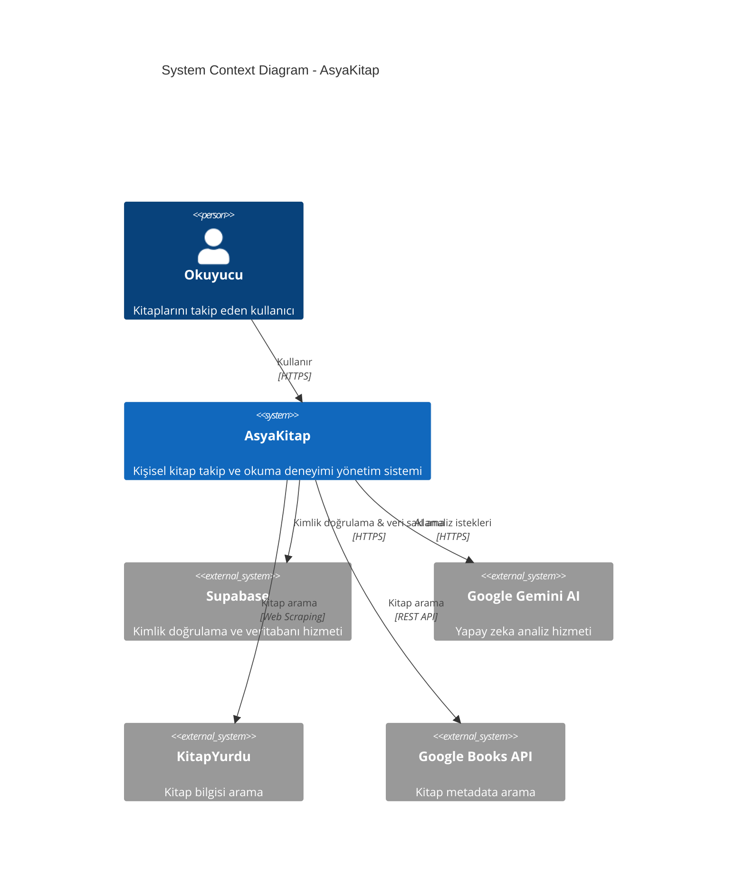
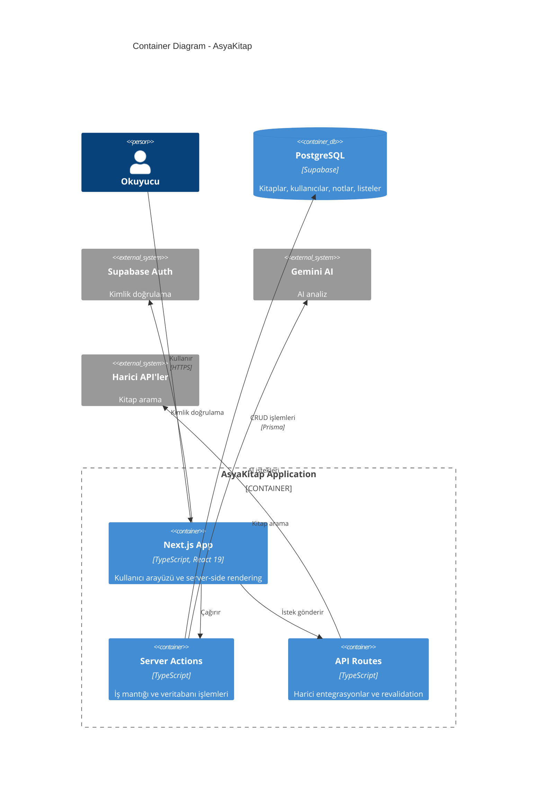
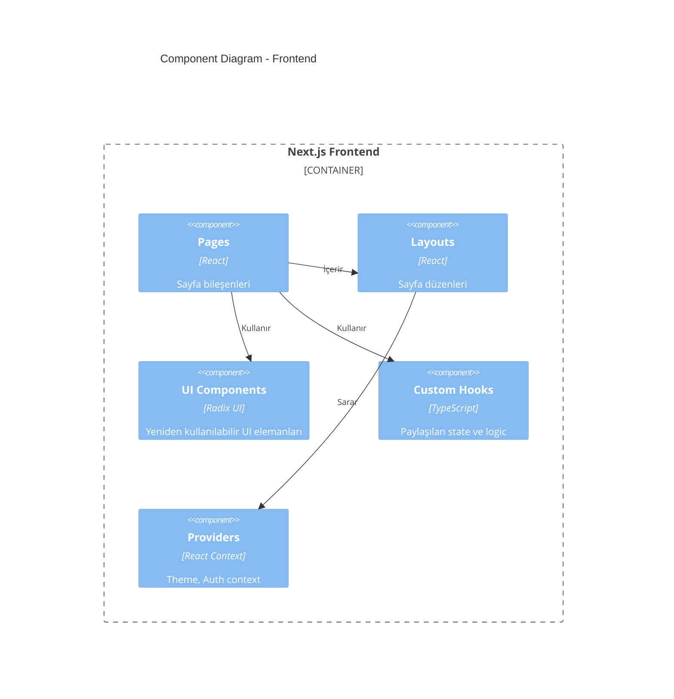
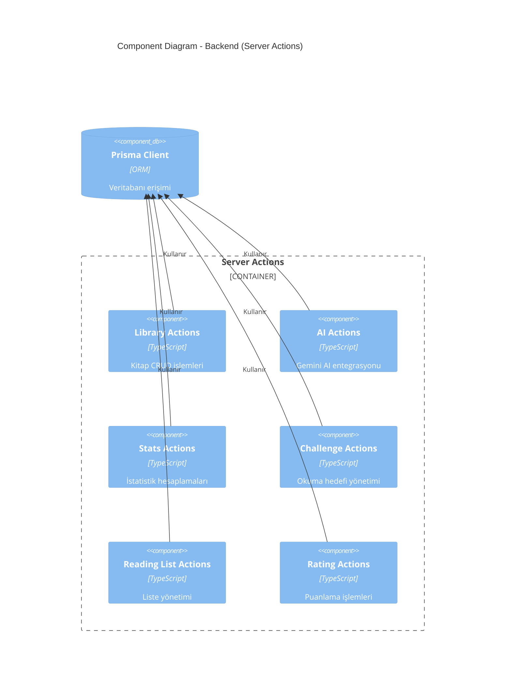
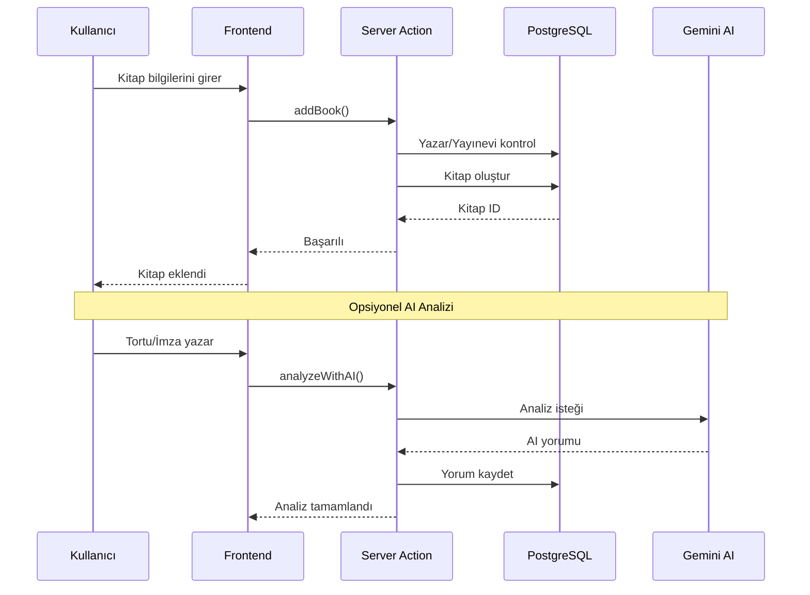
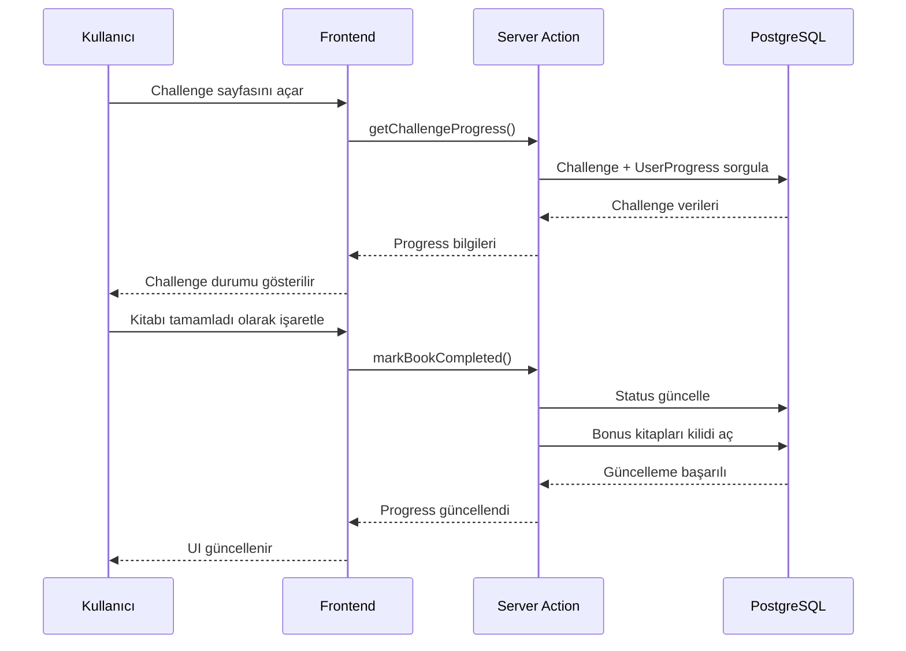

# C4 Model - AsyaKitap

## Level 1: System Context Diagram

## Level 2: Container Diagram

## Level 3: Component Diagram

### Frontend Components

### Backend Components

## Veri Akışı

### Kitap Ekleme Akışı

### Okuma Hedefi (Challenge) Akışı

