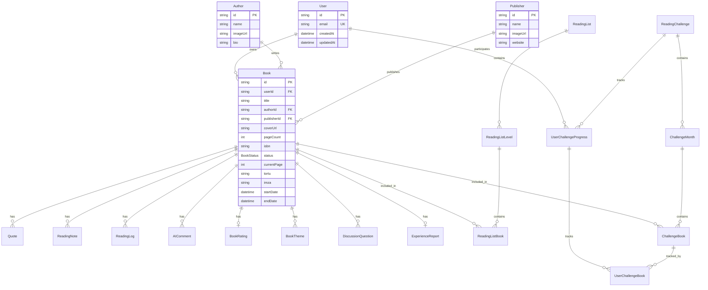

# Veri Modeli - AsyaKitap

## Entity Relationship Diagram



## Model Detayları

### User
Kullanıcı hesabı. Supabase Auth ile senkronize.

| Alan | Tip | Açıklama |
|------|-----|----------|
| id | UUID | Primary key (Supabase user id) |
| email | String | Unique email |

### Book
Ana kitap entity'si.

| Alan | Tip | Açıklama |
|------|-----|----------|
| id | CUID | Primary key |
| userId | UUID | Sahip kullanıcı |
| title | String | Kitap başlığı |
| authorId | CUID | Yazar referansı |
| publisherId | CUID | Yayınevi referansı |
| status | Enum | TO_READ, READING, COMPLETED, DNF |
| currentPage | Int | Mevcut sayfa (default: 0) |
| pageCount | Int | Toplam sayfa sayısı |
| tortu | Text | Kitaptan akılda kalanlar |
| imza | Text | Yazarın üslubu hakkında |
| inLibrary | Boolean | Fiziksel kütüphanede mi |
| startDate | DateTime | Okumaya başlama tarihi |
| endDate | DateTime | Bitirme tarihi |

### BookRating
Detaylı kitap puanlama sistemi (10 kategori).

| Alan | Tip | Açıklama |
|------|-----|----------|
| konuFikir | 1-10 | Konu özgünlüğü |
| akicilik | 1-10 | Okuma akışı |
| derinlik | 1-10 | Konu derinliği |
| etki | 1-10 | Bıraktığı iz |
| dilUslup | 1-10 | Dil kalitesi |
| karakterAnlatim | 1-10 | Karakter/anlatım |
| ozgunluk | 1-10 | Yazarın sesi |
| baskiTasarim | 1-10 | Fiziksel kalite |
| tavsiyeEderim | 1-10 | Tavsiye skoru |
| genelPuan | 1-10 | Genel değerlendirme |
| ortalamaPuan | Float | Hesaplanan ortalama |

### ReadingList (Okuma Listeleri)
Tematik okuma listeleri sistemi.

```
ReadingList (Liste)
  └── ReadingListLevel (Seviye)
        └── ReadingListBook (Kitap bağlantısı)
```

### ReadingChallenge (Okuma Hedefi)
Yıllık okuma hedefi sistemi.

```
ReadingChallenge (Yıllık hedef)
  ├── ChallengeMonth (Aylık tema)
  │     └── ChallengeBook (Ana/Bonus kitaplar)
  └── UserChallengeProgress (Kullanıcı ilerlemesi)
        └── UserChallengeBook (Kitap bazlı ilerleme)
```

## Enum Değerleri

### BookStatus
```typescript
enum BookStatus {
  TO_READ    // Okunacak
  READING    // Okunuyor
  COMPLETED  // Tamamlandı
  DNF        // Bırakıldı (Did Not Finish)
}
```

### ChallengeBookRole
```typescript
enum ChallengeBookRole {
  MAIN   // Ana kitap (ayda 1)
  BONUS  // Bonus kitap (ana tamamlanınca açılır)
}
```

### ChallengeBookStatus
```typescript
enum ChallengeBookStatus {
  LOCKED      // Kilitli (bonus)
  NOT_STARTED // Başlanmadı
  IN_PROGRESS // Okunuyor
  COMPLETED   // Tamamlandı
}
```

### QuestionType
```typescript
enum QuestionType {
  REFLECTION  // Kişisel yansıma
  ANALYSIS    // Analiz sorusu
  CONNECTION  // Bağlantı kurma
  OPINION     // Görüş/tartışma
}
```

## İndeksler

Performans optimizasyonu için oluşturulan indeksler:

```prisma
// Book tablosu
@@index([userId])
@@index([authorId])
@@index([publisherId])
@@index([userId, status])
@@index([userId, inLibrary])
@@index([userId, updatedAt])

// Quote, ReadingNote, ReadingLog
@@index([bookId])
@@index([bookId, createdAt])

// Challenge ilişkileri
@@index([challengeId])
@@index([monthId])
@@index([monthId, role])
```

## Cascade Delete Kuralları

Veri bütünlüğü için cascade delete:

| Parent | Child | Davranış |
|--------|-------|----------|
| User | Book | CASCADE |
| Book | Quote, ReadingNote, ReadingLog | CASCADE |
| Book | BookRating, BookTheme | CASCADE |
| Book | DiscussionQuestion, ExperienceReport | CASCADE |
| ReadingList | ReadingListLevel | CASCADE |
| ReadingListLevel | ReadingListBook | CASCADE |
| ReadingChallenge | ChallengeMonth | CASCADE |
| ChallengeMonth | ChallengeBook | CASCADE |
