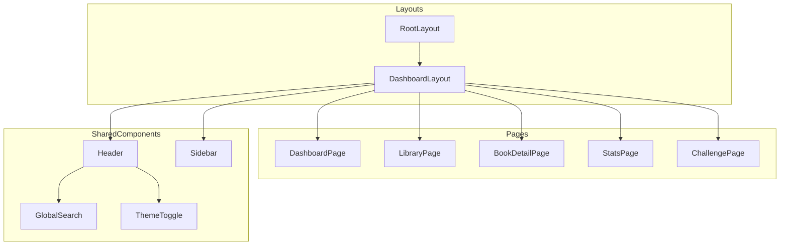
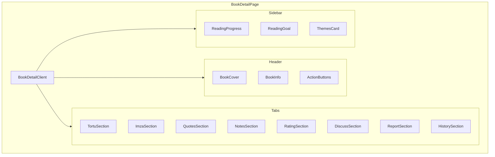
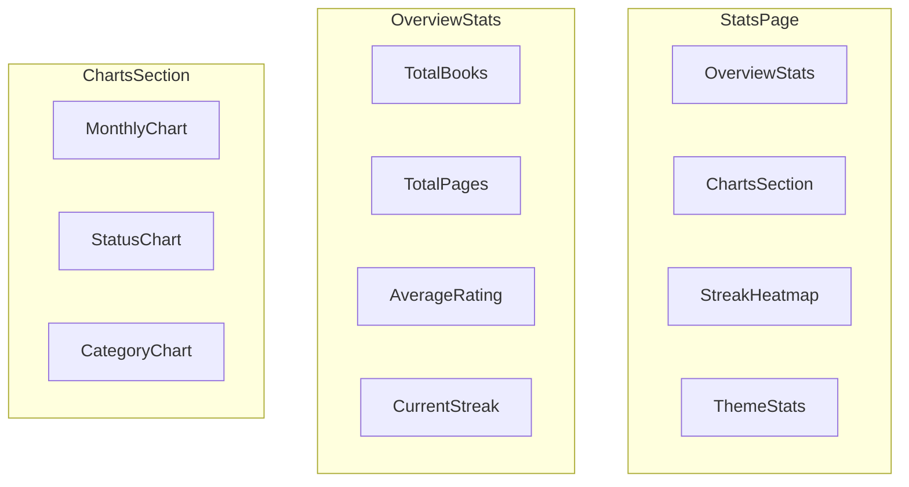
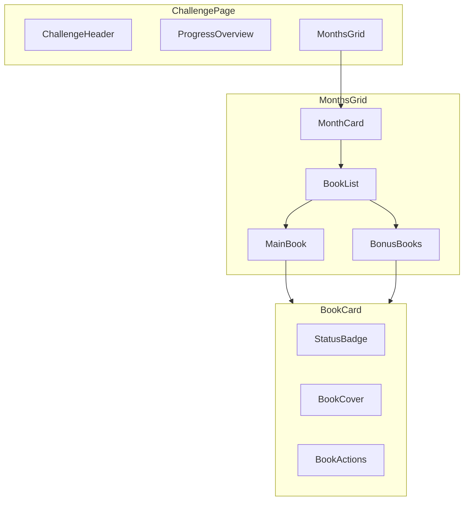
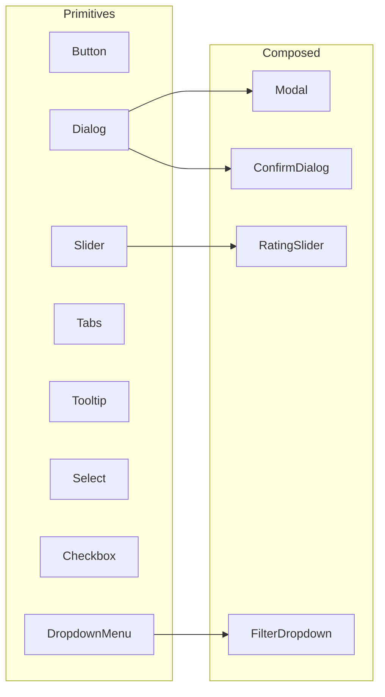
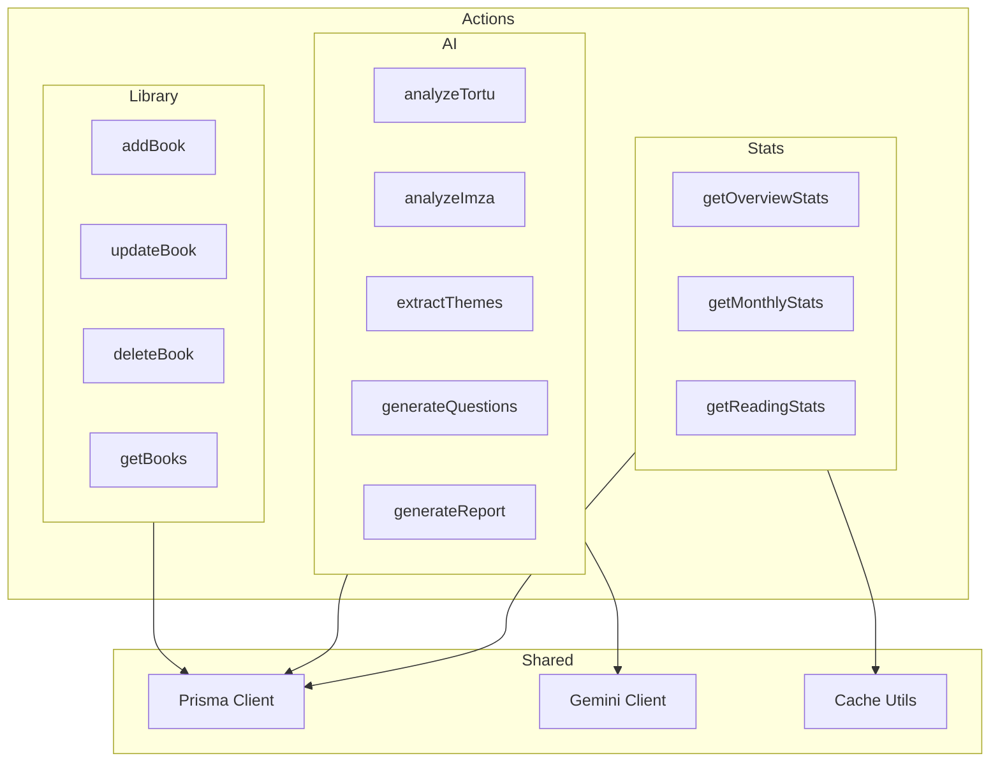

# Bileşen Diyagramı

## UI Bileşen Hiyerarşisi

```mermaid
graph TD
    subgraph Layouts
        ROOT[RootLayout]
        DASH_L[DashboardLayout]
    end

    subgraph Pages
        DASH_P[DashboardPage]
        LIB_P[LibraryPage]
        BOOK_P[BookDetailPage]
        STATS_P[StatsPage]
        CHAL_P[ChallengePage]
    end

    subgraph SharedComponents
        HEADER[Header]
        SIDEBAR[Sidebar]
        SEARCH[GlobalSearch]
        THEME[ThemeToggle]
    end

    ROOT --> DASH_L
    DASH_L --> HEADER
    DASH_L --> SIDEBAR
    HEADER --> SEARCH
    HEADER --> THEME
    DASH_L --> DASH_P
    DASH_L --> LIB_P
    DASH_L --> BOOK_P
    DASH_L --> STATS_P
    DASH_L --> CHAL_P
```

## Book Detail Bileşenleri

```mermaid
graph TD
    subgraph BookDetailPage
        CLIENT[BookDetailClient]

        subgraph Header
            COVER[BookCover]
            INFO[BookInfo]
            ACTIONS[ActionButtons]
        end

        subgraph Tabs
            TORTU[TortuSection]
            IMZA[ImzaSection]
            QUOTES[QuotesSection]
            NOTES[NotesSection]
            RATING[RatingSection]
            DISCUSS[DiscussSection]
            REPORT[ReportSection]
            HISTORY[HistorySection]
        end

        subgraph Sidebar
            PROGRESS[ReadingProgress]
            READING_GOAL[ReadingGoal]
            THEMES[ThemesCard]
        end
    end

    CLIENT --> Header
    CLIENT --> Tabs
    CLIENT --> Sidebar
```

## Stats Bileşenleri

```mermaid
graph TD
    subgraph StatsPage
        OVERVIEW[OverviewStats]
        CHARTS[ChartsSection]
        HEATMAP[StreakHeatmap]
        THEMES[ThemeStats]
    end

    subgraph OverviewStats
        TOTAL[TotalBooks]
        PAGES[TotalPages]
        AVG[AverageRating]
        STREAK[CurrentStreak]
    end

    subgraph ChartsSection
        MONTHLY[MonthlyChart]
        STATUS[StatusChart]
        CATEGORY[CategoryChart]
    end
```

## Challenge Bileşenleri

```mermaid
graph TD
    subgraph ChallengePage
        HEADER[ChallengeHeader]
        PROGRESS[ProgressOverview]
        MONTHS[MonthsGrid]
    end

    subgraph MonthsGrid
        MONTH[MonthCard]
        BOOKS[BookList]
        MAIN[MainBook]
        BONUS[BonusBooks]
    end

    subgraph BookCard
        STATUS[StatusBadge]
        COVER[BookCover]
        ACTIONS[BookActions]
    end

    MONTHS --> MONTH
    MONTH --> BOOKS
    BOOKS --> MAIN
    BOOKS --> BONUS
    MAIN --> BookCard
    BONUS --> BookCard
```

## UI Primitives (Radix UI)

```mermaid
graph LR
    subgraph Primitives
        BTN[Button]
        DLG[Dialog]
        DD[DropdownMenu]
        TAB[Tabs]
        TT[Tooltip]
        SEL[Select]
        CHK[Checkbox]
        SLD[Slider]
    end

    subgraph Composed
        MODAL[Modal]
        CONFIRM[ConfirmDialog]
        RATING[RatingSlider]
        FILTER[FilterDropdown]
    end

    DLG --> MODAL
    DLG --> CONFIRM
    SLD --> RATING
    DD --> FILTER
```

## Server Actions Yapısı

```mermaid
graph TD
    subgraph Actions
        subgraph Library
            ADD[addBook]
            UPDATE[updateBook]
            DELETE[deleteBook]
            GET[getBooks]
        end

        subgraph AI
            TORTU[analyzeTortu]
            IMZA[analyzeImza]
            THEMES[extractThemes]
            DISCUSS[generateQuestions]
            REPORT[generateReport]
        end

        subgraph Stats
            OVERVIEW[getOverviewStats]
            MONTHLY[getMonthlyStats]
            READING[getReadingStats]
        end
    end

    subgraph Shared
        PRISMA[Prisma Client]
        GEMINI[Gemini Client]
        CACHE[Cache Utils]
    end

    Library --> PRISMA
    AI --> PRISMA
    AI --> GEMINI
    Stats --> PRISMA
    Stats --> CACHE
```
