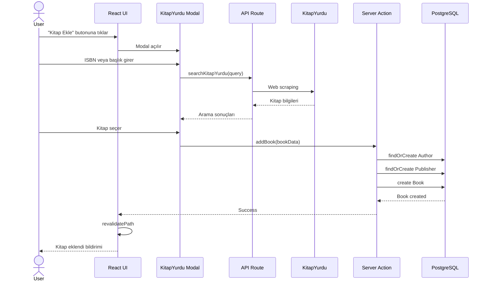
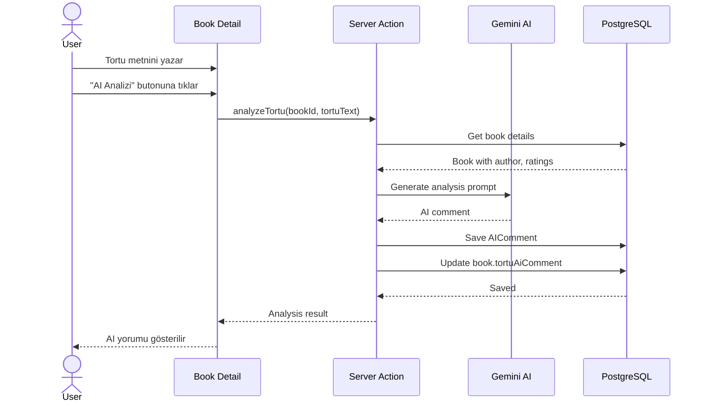
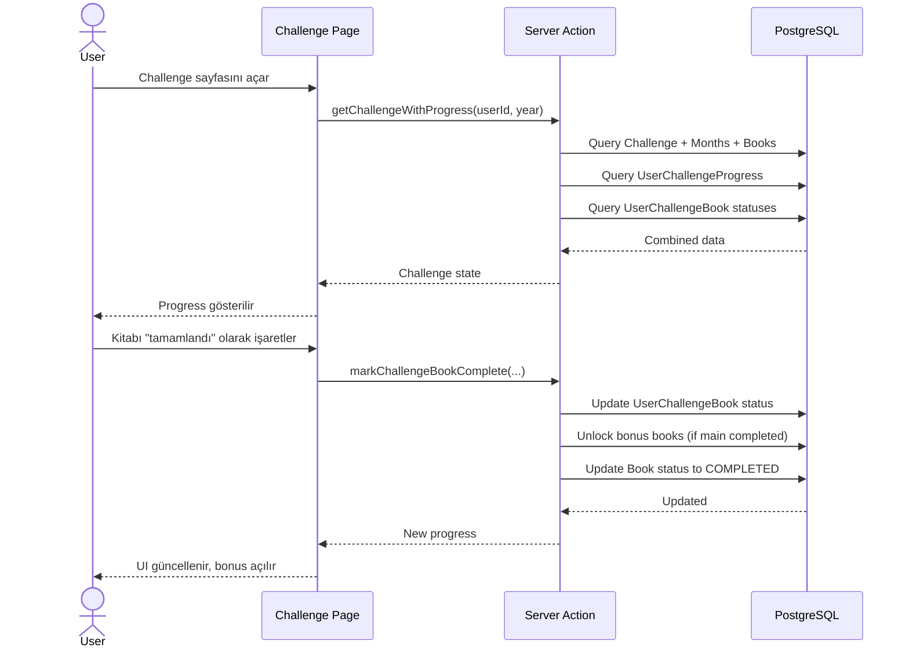
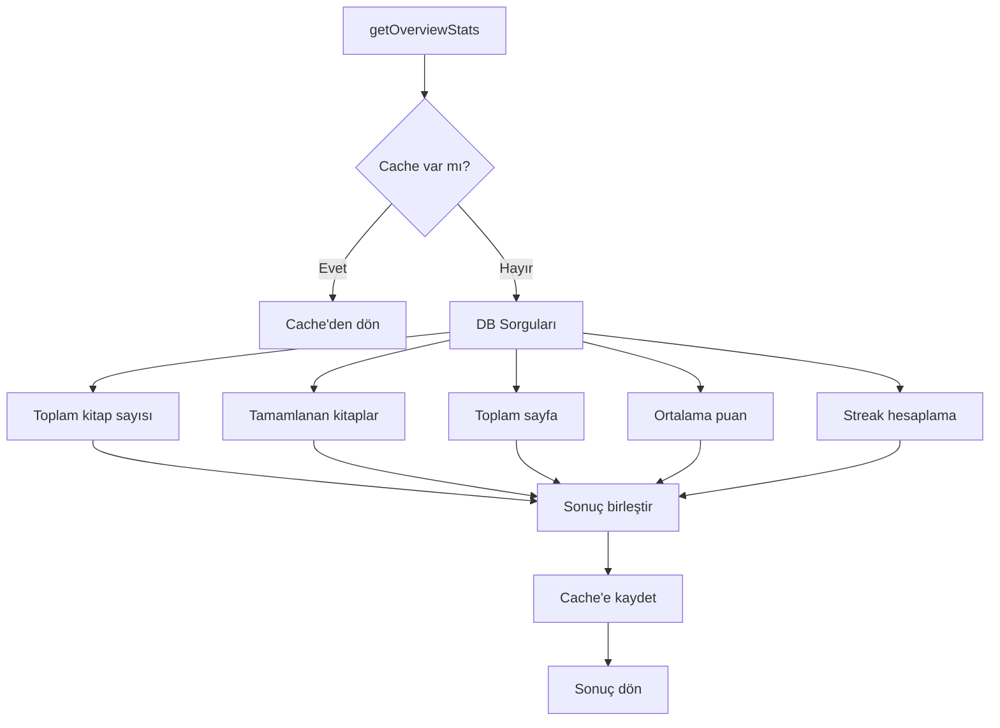
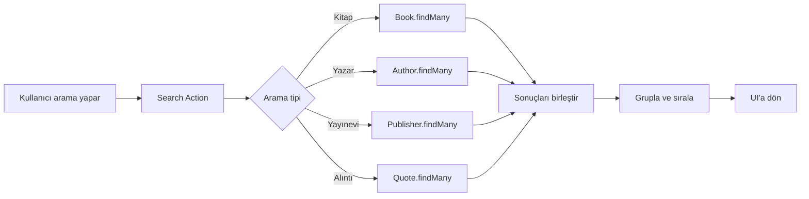

# Veri Akış Diyagramları

## Kitap Ekleme Akışı

```mermaid
sequenceDiagram
    actor User
    participant UI as React UI
    participant Modal as KitapYurdu Modal
    participant API as API Route
    participant KY as KitapYurdu
    participant SA as Server Action
    participant DB as PostgreSQL

    User->>UI: "Kitap Ekle" butonuna tıklar
    UI->>Modal: Modal açılır
    User->>Modal: ISBN veya başlık girer
    Modal->>API: searchKitapYurdu(query)
    API->>KY: Web scraping
    KY-->>API: Kitap bilgileri
    API-->>Modal: Arama sonuçları
    User->>Modal: Kitap seçer
    Modal->>SA: addBook(bookData)
    SA->>DB: findOrCreate Author
    SA->>DB: findOrCreate Publisher
    SA->>DB: create Book
    DB-->>SA: Book created
    SA-->>UI: Success
    UI->>UI: revalidatePath
    UI-->>User: Kitap eklendi bildirimi
```

## AI Analiz Akışı

```mermaid
sequenceDiagram
    actor User
    participant UI as Book Detail
    participant SA as Server Action
    participant AI as Gemini AI
    participant DB as PostgreSQL

    User->>UI: Tortu metnini yazar
    User->>UI: "AI Analizi" butonuna tıklar
    UI->>SA: analyzeTortu(bookId, tortuText)
    SA->>DB: Get book details
    DB-->>SA: Book with author, ratings
    SA->>AI: Generate analysis prompt
    AI-->>SA: AI comment
    SA->>DB: Save AIComment
    SA->>DB: Update book.tortuAiComment
    DB-->>SA: Saved
    SA-->>UI: Analysis result
    UI-->>User: AI yorumu gösterilir
```

## Okuma Hedefi İlerleme Akışı

```mermaid
sequenceDiagram
    actor User
    participant UI as Challenge Page
    participant SA as Server Action
    participant DB as PostgreSQL

    User->>UI: Challenge sayfasını açar
    UI->>SA: getChallengeWithProgress(userId, year)
    SA->>DB: Query Challenge + Months + Books
    SA->>DB: Query UserChallengeProgress
    SA->>DB: Query UserChallengeBook statuses
    DB-->>SA: Combined data
    SA-->>UI: Challenge state
    UI-->>User: Progress gösterilir

    User->>UI: Kitabı "tamamlandı" olarak işaretler
    UI->>SA: markChallengeBookComplete(...)
    SA->>DB: Update UserChallengeBook status
    SA->>DB: Unlock bonus books (if main completed)
    SA->>DB: Update Book status to COMPLETED
    DB-->>SA: Updated
    SA-->>UI: New progress
    UI-->>User: UI güncellenir, bonus açılır
```

## İstatistik Hesaplama Akışı

```mermaid
flowchart TD
    A[getOverviewStats] --> B{Cache var mı?}
    B -->|Evet| C[Cache'den dön]
    B -->|Hayır| D[DB Sorguları]

    D --> E[Toplam kitap sayısı]
    D --> F[Tamamlanan kitaplar]
    D --> G[Toplam sayfa]
    D --> H[Ortalama puan]
    D --> I[Streak hesaplama]

    E --> J[Sonuç birleştir]
    F --> J
    G --> J
    H --> J
    I --> J

    J --> K[Cache'e kaydet]
    K --> L[Sonuç dön]
```

## Arama Akışı

```mermaid
flowchart LR
    A[Kullanıcı arama yapar] --> B[Search Action]
    B --> C{Arama tipi}

    C -->|Kitap| D[Book.findMany]
    C -->|Yazar| E[Author.findMany]
    C -->|Yayınevi| F[Publisher.findMany]
    C -->|Alıntı| G[Quote.findMany]

    D --> H[Sonuçları birleştir]
    E --> H
    F --> H
    G --> H

    H --> I[Grupla ve sırala]
    I --> J[UI'a dön]
```
