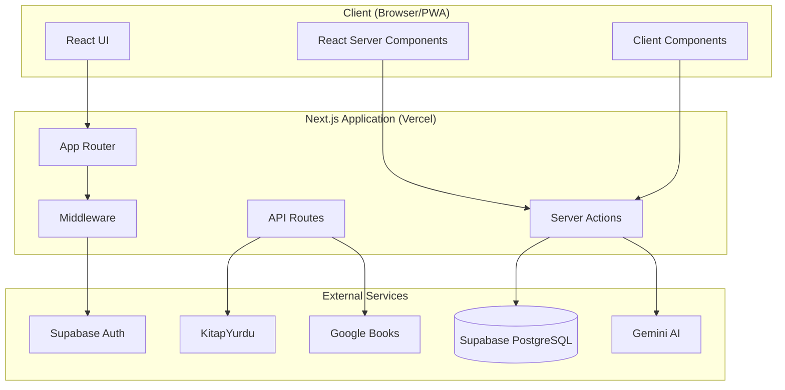
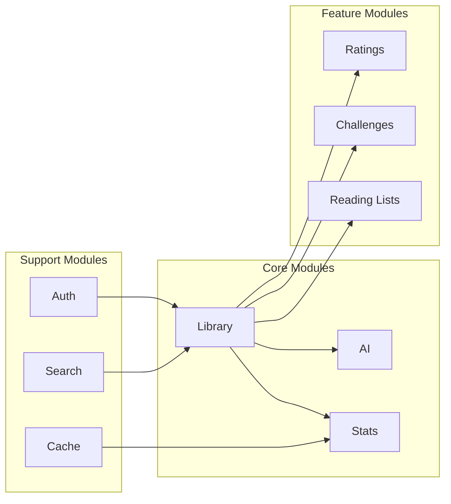
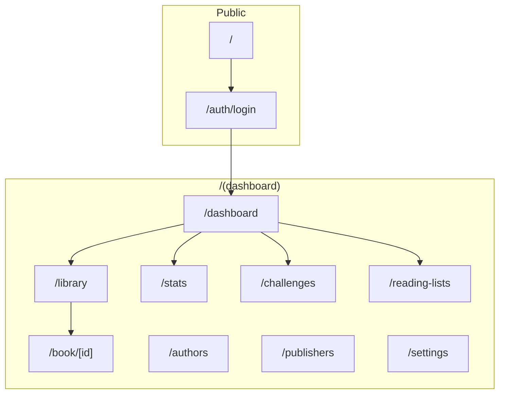

# Sistem Genel Bakış

## Üst Düzey Mimari

```mermaid
graph TB
    subgraph Client ["Client (Browser/PWA)"]
        UI[React UI]
        RSC[React Server Components]
        CC[Client Components]
    end

    subgraph NextJS ["Next.js Application (Vercel)"]
        AR[App Router]
        SA[Server Actions]
        API[API Routes]
        MW[Middleware]
    end

    subgraph External ["External Services"]
        SB[(Supabase PostgreSQL)]
        AUTH[Supabase Auth]
        AI[Gemini AI]
        KY[KitapYurdu]
        GB[Google Books]
    end

    UI --> AR
    RSC --> SA
    CC --> SA
    AR --> MW
    MW --> AUTH
    SA --> SB
    SA --> AI
    API --> KY
    API --> GB
```

## Modül Yapısı

```mermaid
graph LR
    subgraph Core ["Core Modules"]
        LIB[Library]
        STATS[Stats]
        AI_MOD[AI]
    end

    subgraph Features ["Feature Modules"]
        RL[Reading Lists]
        CH[Challenges]
        RT[Ratings]
    end

    subgraph Support ["Support Modules"]
        AUTH_M[Auth]
        SEARCH[Search]
        CACHE[Cache]
    end

    LIB --> STATS
    LIB --> AI_MOD
    LIB --> RL
    LIB --> CH
    LIB --> RT
    AUTH_M --> LIB
    SEARCH --> LIB
    CACHE --> STATS
```

## Sayfa Yapısı

```mermaid
graph TD
    subgraph Public
        HOME["/"]
        LOGIN["/auth/login"]
    end

    subgraph Dashboard ["/(dashboard)"]
        DASH["/dashboard"]
        LIBRARY["/library"]
        BOOK["/book/[id]"]
        STATS_P["/stats"]
        CHALLENGES["/challenges"]
        LISTS["/reading-lists"]
        AUTHORS["/authors"]
        PUBLISHERS["/publishers"]
        SETTINGS["/settings"]
    end

    HOME --> LOGIN
    LOGIN --> DASH
    DASH --> LIBRARY
    DASH --> STATS_P
    LIBRARY --> BOOK
    DASH --> CHALLENGES
    DASH --> LISTS
```
